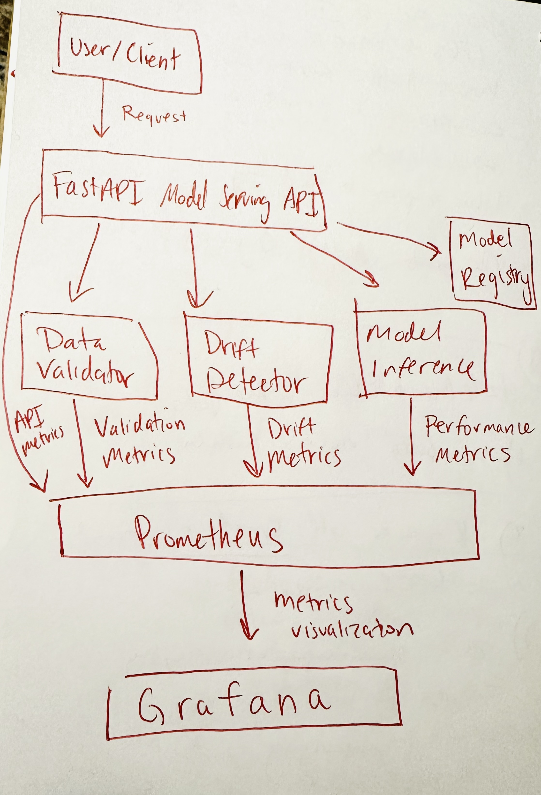

# MLOps Observability Platform

**A production-grade platform for monitoring, validating, and maintaining ML models in real-world environments with comprehensive observability and alerting.**

## 🚀 Features

- **Model Observability**: Comprehensive metrics collection for model performance monitoring
- **Data Validation**: Schema validation and data quality checks for production traffic
- **Drift Detection**: Statistical methods to detect and quantify data drift in real-time
- **Model Registry**: Version management and lifecycle tracking for ML models
- **Performance Visualization**: Pre-built Grafana dashboards for real-time monitoring
- **Alerting**: Configurable alerts for model degradation and data quality issues
- **Testing Framework**: End-to-end and integration test suites to validate platform functionality

## 🚧 Architecture

This platform implements a layered architecture:

1. **API Layer:** FastAPI for model serving and monitoring endpoints with built-in observability
2. **Validation Layer:** Automated schema and data drift checks for data quality assurance
3. **Monitoring Layer:** Prometheus for metrics collection and storage with custom metrics
4. **Model Registry:** MLflow for versioning, metadata, and lifecycle management
5. **Visualization Layer:** Grafana dashboards with performance visualization and alerting

The architecture follows best practices for observability with separation of concerns and modular design:



### 📦 Project Structure

```
mlops-observability/
├── README.md
├── architecture.png
├── docker-compose.yml
├── src/
│   ├── api/
│   ├── monitoring/
│   ├── data_validation/
│   ├── model_registry/
│   └── dashboard/
└── tests/
```

### Model Registry

The Model Registry component provides a centralized repository for model versioning, metadata tracking, and lifecycle management. Key features include:

- Model versioning and storage
- Model metadata and lineage tracking
- Performance metrics comparison between versions
- Stage transitions (development → staging → production)
- Integration with monitoring systems for observability

#### Usage Example

```python
from src.model_registry.client import ModelRegistry
from src.model_registry.version import compare_model_versions

# Initialize registry client
registry = ModelRegistry(tracking_uri="http://mlflow-server:5000")

# Register a new model
model_uri = registry.register_model(
    model_path="s3://models/model.pkl",
    name="fraud_detection",
    tags={"algorithm": "xgboost", "owner": "data-science-team"}
)

# Compare different model versions
comparison = compare_model_versions(
    registry,
    model_name="fraud_detection",
    version1="1",
    version2="2",
    metric="auc"
)
```

## ⚙️ Installation & Setup

### Prerequisites

- Docker and Docker Compose
- Python 3.8+
- Git

### Quickstart

1. **Clone the repo:**  
   ```bash
   git clone https://github.com/hmm29/mlops-observability.git
   cd mlops-observability
   ```

2. **Start the monitoring stack:**  
   ```bash
   docker-compose -f docker/docker-compose-grafana.yml up -d
   ```

3. **Access services:**  
   - API: `http://localhost:8000`
   - Grafana: `http://localhost:3000` (login: admin/admin)
   - Prometheus: `http://localhost:9090`

For detailed setup instructions, see [SETUP.md](SETUP.md).

## 📝 Implementation Highlights

### Model Monitoring Components

- **Comprehensive Metrics Collection:**
  - Real-time performance metrics tracking
  - Request volume and latency monitoring
  - Error tracking and categorization
  
- **Data Quality Monitoring:**
  - Feature drift detection using KS tests
  - Input validation and schema enforcement
  - Automated anomaly detection
  
- **Visualization & Alerting:**
  - Interactive Grafana dashboards with performance panels
  - Real-time alerting for drift detection
  - Customizable notification channels

### 📝 Current Status

✅ **Completed Components**:
- [x] Model Registry implementation
- [x] Data Validation (Drift Detection and Schema Validation)
- [x] Unit tests for model registry
- [x] Metrics Collection Service
  - [x] Prometheus metrics collector
  - [x] Model performance metrics
  - [x] System health monitoring
- [x] API Endpoints
  - [x] FastAPI model serving
  - [x] Prediction monitoring
  - [x] Swagger UI documentation
- [x] Dashboard implementation
  - [x] Grafana dashboards for model monitoring
  - [x] Performance visualization panels
  - [x] Data drift monitoring
- [x] Alerting configuration
  - [x] Feature drift alerts
  - [x] High error rate detection
  - [x] Latency threshold monitoring
- [x] Comprehensive Testing
  - [x] Integration tests
  - [x] End-to-end tests
  - [x] Unit tests for model registry
- [x] Documentation
  - [x] API documentation
  - [x] Setup instructions
  - [x] Deployment guides

### 📝 Next Steps

1. Extended Monitoring Features:
   - [ ] A/B testing support
   - [ ] Multi-model comparison dashboards
   - [ ] Custom user-defined metrics

2. Enhanced Testing:
   - [ ] Load testing framework
   - [ ] Chaos engineering tests
   - [ ] Continuous integration pipelines

3. Advanced Features:
   - [ ] Automated model retraining triggers
   - [ ] Custom notification channels
   - [ ] Advanced data quality monitoring

## 🧹 Testing Framework

### Integration Tests

Our integration tests validate component interactions:

```bash
# Run integration tests
pytest tests/test_integration.py
```

These tests verify:
- API prediction endpoints
- Input validation mechanisms
- Metrics collection
- Drift detection algorithms

### End-to-End Tests

Complete system validation is done through E2E tests:

```bash
# Run E2E tests
pytest tests/test_e2e.py
```

These tests confirm:
- Full prediction workflow from request to visualization
- Data drift detection and alerting
- Grafana dashboard accessibility
- System resilience under various conditions

Detailed testing documentation is available in [tests/README.md](tests/README.md).

## 🔍 Usage

### Making Predictions

```python
import requests
import json

# Send prediction request to the API
url = "http://localhost:8000/predict"
payload = {
    "features": {
        "feature1": 0.5,
        "feature2": 1.0,
        "feature3": "category_a"
    },
    "request_id": "test-123"
}

response = requests.post(url, json=payload)
prediction = response.json()
print(prediction)
```

### Model Drift Monitoring

```python
from src.monitoring.metrics import MLMetricsCollector
from src.data_validation.drift import DriftDetector
import pandas as pd

# Initialize metrics collector
metrics = MLMetricsCollector(model_name="fraud_detection", version="1.0")

# Track model performance
with metrics.track_predictions():
    predictions = model.predict(features)
    
# Check for data drift
detector = DriftDetector(reference_data=training_data)
results = detector.detect_drift(current_data, threshold=0.05)

if results["drift_detected"]:
    print(f"Drift detected in features: {results['flagged_features']}")
```

### Registering a New Model

```python
from src.model_registry.client import ModelRegistry

registry = ModelRegistry(tracking_uri="http://mlflow-server:5000")
model_uri = registry.register_model(
    model_path="path/to/model.pkl",
    name="fraud_detection",
    tags={"algorithm": "xgboost", "version": "1.0.0"}
)
```

## 👍 Development

### Directory Structure

```
mlops-observability/
├── docker/                 # Docker configuration files
│   ├── prometheus/         # Prometheus configuration
│   └── grafana/            # Grafana provisioning
├── grafana/                # Grafana dashboards and alerts
│   ├── dashboards/         # Dashboard templates
│   └── alerts/             # Alert configurations
├── src/                    # Source code
│   ├── api/                # FastAPI service
│   ├── monitoring/         # Metrics collection
│   ├── data_validation/    # Schema and drift detection
│   └── model_registry/     # Model versioning
└── tests/                  # Test suite
    ├── model_registry/     # Unit tests
    ├── test_integration.py # Integration tests
    └── test_e2e.py         # End-to-end tests
```

### Contributing

1. Fork the repository
2. Create a feature branch (`git checkout -b feature/amazing-feature`)
3. Implement your changes
4. Add tests for your implementation
5. Update documentation as needed
6. Commit your changes (`git commit -m 'Add amazing feature'`)
7. Push to the branch (`git push origin feature/amazing-feature`)
8. Open a Pull Request

## 💡 Conclusion

The MLOps Observability Platform provides a comprehensive solution for monitoring ML models in production environments. With real-time performance tracking, data quality monitoring, and automated alerting, it helps teams maintain reliable AI systems at scale.

Key benefits:
- Early detection of model degradation
- Proactive data quality management
- Streamlined MLOps workflows
- Enhanced model reliability and user trust

For detailed setup and usage instructions, refer to [SETUP.md](SETUP.md).

## 📜 License

This project is licensed under the MIT License - see the [LICENSE](LICENSE) file for details.
