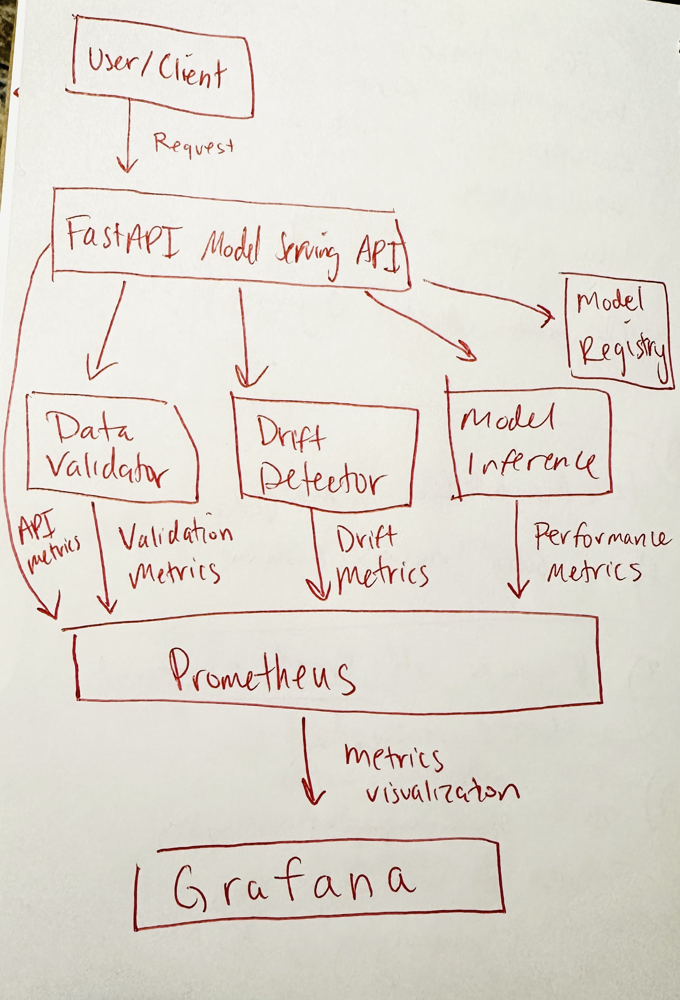

# MLOps Observability Platform

[](https://github.com/hmm29/mlops-observability/actions/workflows/ci.yml)

A reference implementation of model monitoring: a FastAPI service that serves a model and reports on itself, with Prometheus collecting the metrics and Grafana showing dashboards and alert rules.

It answers the questions that come up after a model ships. Is it getting requests? How fast is it? Are inputs valid? Has production data moved away from the training data?

The served model is a small example trained on synthetic data, so the monitoring has something real to watch. This is a learning project, not a system that has run in production.



## What it does

- **Serves predictions.** `POST /predict` validates the input, scores it with a scikit-learn pipeline and returns the prediction and probability.
- **Validates inputs.** Each request is checked against a JSON schema: required features, numeric types and ranges, allowed categories. Invalid requests get a 422 with every problem listed.
- **Detects drift.** Recent requests are kept in a sliding window (200 rows by default). Every 25 requests the window is compared with the training data: a two-sample Kolmogorov-Smirnov test for numeric features and Jensen-Shannon divergence for categorical ones.
- **Exports metrics.** `GET /metrics` exposes prediction counts, errors by type, a latency histogram, drift scores per feature and HTTP request metrics, in Prometheus format.
- **Dashboards and alerts.** Grafana is provisioned with one dashboard (six panels) and three alert rules: feature drift, error rate above 5%, and p95 latency above 500 ms.
- **Model registry.** A thin client over MLflow's model registry registers model bundles, moves versions between stages and compares versions by metric. The API can serve the Production version from the registry.

## Run the stack

You need Docker.

```bash
git clone https://github.com/hmm29/mlops-observability.git
cd mlops-observability
docker compose up -d --build
```

The image trains the example model during the build. Then:

| Service | URL |
|---|---|
| API docs | http://localhost:8000/docs |
| Prometheus | http://localhost:9090 |
| Grafana | http://localhost:3000 (login `admin` / `admin`, dashboard "Model Monitoring" in the MLOps folder) |

Send traffic so there is something to look at. This sends 200 normal requests, 5 invalid ones and 200 drifted ones:

```bash
docker compose exec api python -m scripts.simulate_traffic
```

The drift panels rise when the drifted requests arrive, and the "Feature drift" alert rule starts firing about two minutes later.

To confirm everything is connected:

```bash
python scripts/check_stack.py
```

## API

```bash
curl -s localhost:8000/predict \
  -H 'Content-Type: application/json' \
  -d '{"features": {"amount": 42.5, "account_age_days": 400, "transactions_last_24h": 2, "merchant_category": "grocery"}, "request_id": "demo-1"}'
```

| Endpoint | Purpose |
|---|---|
| `POST /predict` | Validate, score, record metrics |
| `GET /drift` | The latest drift report and how many rows are in the window |
| `GET /model` | Model metadata, test metrics and feature schema |
| `GET /health` | `ok`, or `degraded` if no model could be loaded |
| `GET /metrics` | Prometheus metrics |

## Run without Docker

Python 3.10 or newer.

```bash
python -m venv .venv && source .venv/bin/activate
pip install -r requirements.txt
python -m scripts.train_model          # writes models/example_model/
uvicorn src.api.main:app --reload
```

## Model registry

The registry needs MLflow and works against a local SQLite file, so no MLflow server is required:

```bash
pip install -r requirements-registry.txt
python -m scripts.train_model --register --tracking-uri sqlite:///mlflow.db
MLFLOW_TRACKING_URI=sqlite:///mlflow.db uvicorn src.api.main:app
```

With `MLFLOW_TRACKING_URI` set, the API downloads and serves the version in the Production stage. From Python:

```python
from src.model_registry import ModelRegistry, compare_model_versions

registry = ModelRegistry("sqlite:///mlflow.db")
registry.get_model_versions("example_model")
compare_model_versions(registry, "example_model", "1", "2", metric="roc_auc")
```

The Docker stack does not use the registry; it serves the model trained into the image.

## Layout

```
src/
  api/                 FastAPI app and HTTP metrics middleware
  data_validation/     schema validation, drift detection, sliding-window monitor
  monitoring/          Prometheus metrics for the model
  model/               synthetic data, training, model bundle
  model_registry/      MLflow registry client and version comparison
scripts/
  train_model.py       train the example model, optionally register it
  simulate_traffic.py  send normal, invalid and drifted requests
  check_stack.py       verify the running Docker stack
monitoring/
  prometheus/          scrape configuration
  grafana/             data source, dashboard and alert rule provisioning
tests/                 unit, API and registry tests
```

## Tests

```bash
pip install -r requirements-dev.txt
pytest -q
```

The tests train the example model and run the real API against it: predictions, validation errors, metrics output, and drift detection on drifted traffic. The registry test uses a real MLflow registry in a temporary SQLite file. On GitHub, a second job builds the Docker stack, sends traffic, and checks that Prometheus is scraping the API and that Grafana loaded the dashboard and alert rules.

## Limitations

- The model and all data are synthetic. Its scores mean nothing outside this demo.
- There are no ground-truth labels in production, so the platform monitors inputs, errors and latency, not live accuracy.
- The drift window and counters live in one process's memory. Several API workers would each keep their own.
- A p-value under 0.05 flags a feature in the drift report, which will happen by chance now and then. The alert rule uses effect size instead (KS statistic above 0.2).
- No alert contact point is configured, so firing alerts show in Grafana only.
- No authentication on the API, and Grafana uses its default password. Local use only.
- The registry client uses MLflow's stage-based API, which MLflow 2.9+ marks as deprecated; requirements pin MLflow 2.x.

## License

MIT
